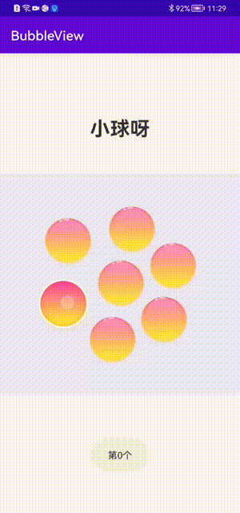

# BubbleView
jbox2d openGl use 悬浮气泡

### 效果

### 1、在自己项目中添加本项目依赖：

    implementation 'com.github.zylfly:BubbleView:1.0.5'

### 2、在根目录中添加：

    allprojects {
        repositories {
           ...
          maven {
              url "https://jitpack.io"
          }
       }
    }
  
 ### 3、在项目中使用：
  
  #### 1.layout中调用
  
    <com.zyl.bubblelibrary.BubbleView
        android:id="@+id/bubbleView"
        android:layout_width="match_parent"
        android:layout_height="334dp" />
        
  #### 2.activity中调用
  
    bubbleView
            .addSmallBit(mImageReSmallId)
            .addBigBit(mImageReBigId)
            .addSetting()
            .addBubbleType {
                it.applyType = 0 //两种受力度模式（0或者1）
                it.bigWhPx = 184.0f //大图的分辨率
                it.smallWhPx = 114.0f//小图的分辨率
                it.maxBallRadius = 2.0499995f //大球的半径
                it.smallChangeBigValue = 2f //动画范围值
                it.animTime = 0.05f  //动画的快慢
            }.addBubbleClick {
                Toast.makeText(this, mImageReSmallId[it].notesExplain, Toast.LENGTH_SHORT).show()
            }
       
       
   #### 3.生命周期
    
     override fun onResume() {
        super.onResume()
        bubbleView.onResume()
    }

    override fun onPause() {
        super.onPause()
        bubbleView.onPause()
    }

    override fun onDestroy() {
        super.onDestroy()
        bubbleView.destroy()
    } 
